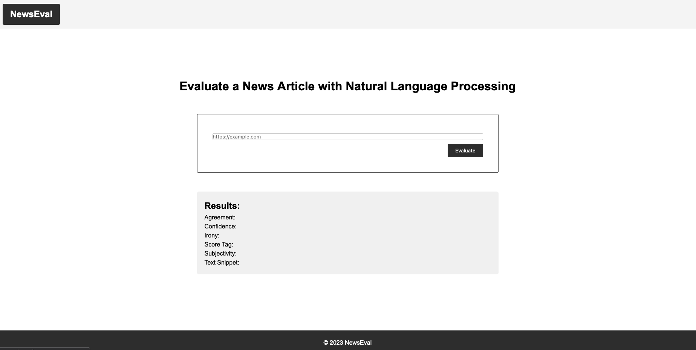
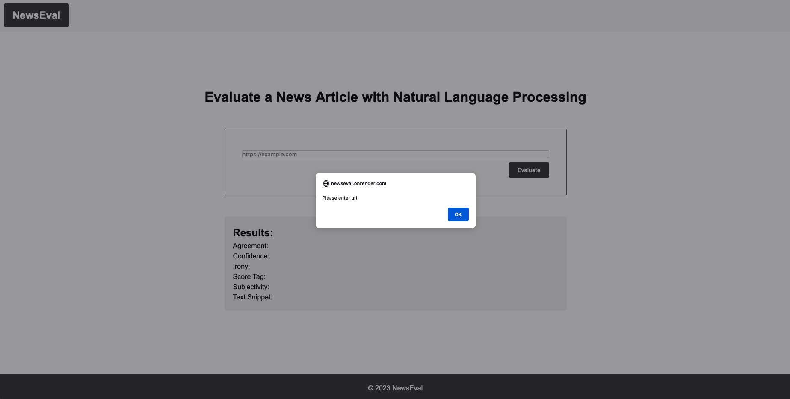
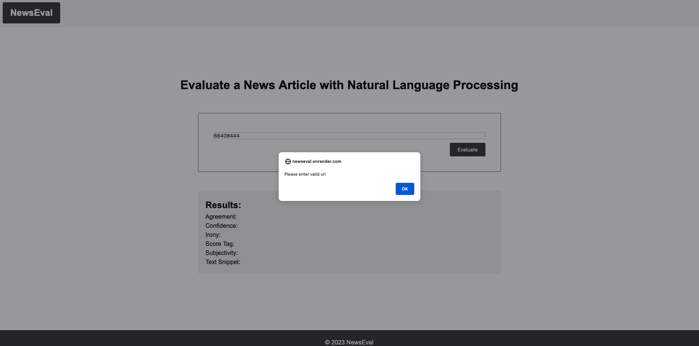
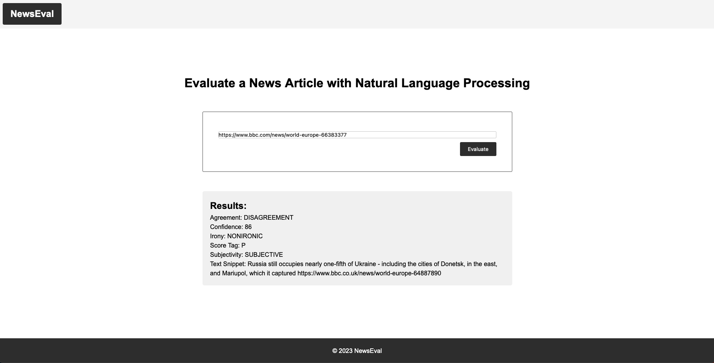

# Introduction

## Project Title

NewsEval is a web tool that allows users to run Natural Language Processing (NLP) to provide sentiment analysis on articles or blogs found on other websites. NLP is the ability of an application to understand the human language, written or oral.

## Project Motivation

The goal of this project is to practice with:

- Setting up Webpack
- Sass styles
- Webpack Loaders and Plugins
- Service workers
- Using APIs and creating requests to external URLs

## Project Description

The Sentiment Analysis API provided by Meaning Cloud was used to interact with their NLP system. The tool helps us categorize the information in the article, such as whether the content is subjective (opinion) or objective (fact-based) and whether the tone is positive, neutral or negative. Users can get results in the following areas:

- Agreement: Marks the agreement between the sentiments detected in the text, the sentence or the segment it refers to. It has two possible values:
  - AGREEMENT: the different elements have the same polarity.
  - DISAGREEMENT: there is disagreement between the different elements' polarity.
- Confidence: Represents the confidence associated with the sentiment analysis performed on the text. Its value is an integer number in the 0-100 range.
- Irony:Indicates the irony of the text. It has two possible values:

  - NONIRONIC: the text does not have any irony marks.
  - IRONIC: the text has irony marks.

- Score Tag:Polarity of the element it refers to: global polarity,polarity_term, sentimented_concept, sentimented_entity, segment or sentence. Possible values:

  - P+: strong positive
  - P: positive
  - NEU: neutral
  - N: negative
  - N+: strong negative
  - NONE: without polarity

- Subjectivity:Marks the subjectivity of the text. It has two possible values:
  - OBJECTIVE: the text does not have any subjectivity marks.
  - SUBJECTIVE: the text has subjective marks.
- Text Snippet: a text snippet from the article

## Project Instructions

- Paste the URL into the input form
  
- If there is no URL, the website will prompt a warning
  
- If there is no valid URL, the website will prompt a warning
  
- Enter a valid URL to get results
  

## Project Prerequisites

Following are the project prerequisites:

- Webserver - Node(v14.21.3)
- Web application framework for routing - Express
- Build tool - Webpack. Using webpack, we will set up the app to have dev and prod environments, each with their own set of tools and commands.
- External script - Service Worker
- External API - Sentiment Analysis API

## Introduction to Natural Language Processing

NLP is a subset of AI that provides computers ability to process or interact with natural human speech. In NLP, machine learning and deep learning are used on massive amounts of data to obtain the rules and understanding of nuance in human speech.

## How to Install and Run the Project

### 1. Use on the Internet

The project has been deployed online.:tada:

Please see https://newseval.onrender.com

### 2. Run locally

#### - Install packages

Run `npm install --legacy-peer-deps` on the terminal

#### - For development environment

Run `npm run build-dev` on the terminal

#### - For production environment

Run `npm run build-prod` and the run `npm run start` on the terminal
